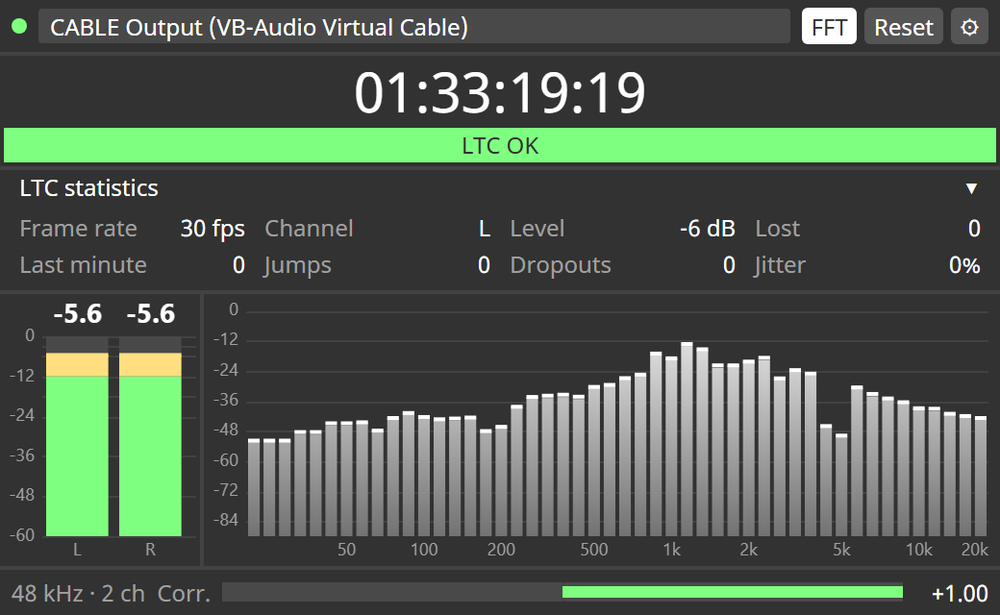

# d3 Audio Meter

**Audio level meter and LTC timecode monitor for disguise Designer.**
A Designer plugin that shows what a disguise server is sending out (or receiving),
styled like a native Designer widget.

[Русская версия](README.ru.md)



## Features

**Outputs** (anything Windows plays out, captured via WASAPI loopback)
- Peak meters per channel: green below −12 dBFS, yellow above; peak-hold line
  turns red above −3 dBFS
- Latched peak readout per channel and a clip indicator (reset with one click)
- 48-band spectrum, 20 Hz – 20 kHz (can be hidden)
- Stereo correlation (+1 mono, 0 wide, < 0 out of phase)

**Inputs — LTC timecode monitoring** (the channel carrying LTC is found automatically)
- Large timecode readout and status: `LTC OK` / `UNSTABLE` (an event in the last
  10 s) / `OVERLOAD` (peak above −1 dBFS) / `WEAK` (below −40 dBFS) /
  `NO SIGNAL` (with a live count of missing frames)
- Frame rate: 23.976 / 24 / 25 / 29.97 DF / 30
- **Lost frames** since reset, as a count and a percentage, plus losses in the last minute
- Jumps with their size (`jump +250 frames (+10.00 s): expected 10:00:20:00, got 10:00:30:00`,
  confirmed by two consecutive frames so a single corrupted frame is not reported
  as a jump), repeated frames, dropouts with their length
  (`signal back at 10:00:41:01: 27 frames lost (1.08 s)`)
- Edge jitter as a signal-quality figure

**Plugin window**
- Opens compact (420×260) and is resizable; text wraps or scales instead of being cut off
- Several plugin windows can watch different devices at the same time
- Device errors (e.g. missing microphone permission) are shown in full

## How it works

```
Windows audio device ──► agent/audio_meter.py ──WebSocket──► plugin/ (Designer)
  output: WASAPI loopback     peak · FFT · correlation          meters, spectrum,
  input:  WASAPI capture      LTC decoder (agent/ltc.py)        LTC panel
```

Designer does not hand audio buffers to plugins, so a small Python agent does
the capture and analysis and streams the results (~47 updates/s) to the plugin
page. The agent also serves the plugin UI at `http://localhost:8765/`, so it
can be checked in a normal browser.

## Requirements

- Windows 10/11 (WASAPI)
- Python 3.11 x64, registered with the `py` launcher (`py -3.11`)
- disguise Designer with plugin support (tested with r32.4)

## Setup

On a server with no internet access, run:

```bash
install_agent.bat
```

It installs the pinned dependencies from the wheels already vendored in
`agent/vendor/` (no PyPI access needed) and starts the agent. Run it again
any time to reinstall or restart.

With internet access, the ordinary way also works:

```bash
pip install -r agent/requirements.txt
python agent/audio_meter.py --list      # devices the agent can see
```

Start the agent in the background (no console window; log in `agent/agent.log`):

```bash
start_agent.bat
```

or in the foreground: `py -3.11 agent/audio_meter.py [--port 8765]`.

Install the plugin: copy the `plugin` folder to `<project>/plugins/audio-meter/`
(or to Designer's shared plugins folder) and open **Audio Meter** from the
plugins menu. The plugin connects to `localhost:8765`; another address can be
set with ⚙ or `?agent=host:port`.

### Notes

- **Inputs need microphone permission.** Windows → Settings → Privacy & security →
  Microphone: allow desktop apps / Python. Python from the Microsoft Store asks
  for consent silently and otherwise hangs; the plugin shows a message instead.
- The device list is read when the agent starts — restart it after connecting
  new hardware.
- ASIO-only devices are not visible (WASAPI only). If Designer holds an input in
  exclusive mode, the agent cannot open it and says so.
- Windows audio "enhancements" (loudness equalisation, EQ) on an output change
  what the meters see — disable them for accurate levels.

## Test signals

Generators write WAV files with a cue sheet of what the plugin should show:

```bash
python tools/make_test_wav.py                 # levels, clip, L/R, sweep, correlation
python tools/make_ltc_wav.py                  # LTC 25 fps with a jump, dropout, clip, weak and noisy parts
python tools/make_ltc_wav.py --fps 29.97 --df
python tools/make_ltc_wav.py --fps 24
```

Play them through a virtual cable (e.g. VB-Cable) or from a Designer timeline.
Expected results are in `test/*.txt` (in Russian).

## Project layout

| Path | What |
|---|---|
| `agent/audio_meter.py` | capture, analysis, WebSocket + static server |
| `agent/ltc.py` | SMPTE LTC decoder with loss / jump / dropout accounting |
| `plugin/` | Designer plugin: `d3plugin.json`, page, `disguise-ui.css` (Designer look) |
| `tools/` | test signal generators |
| `install_agent.bat` | offline install of dependencies + start |
| `start_agent.bat` | runs the agent in the background |

## License

[MIT](LICENSE)
